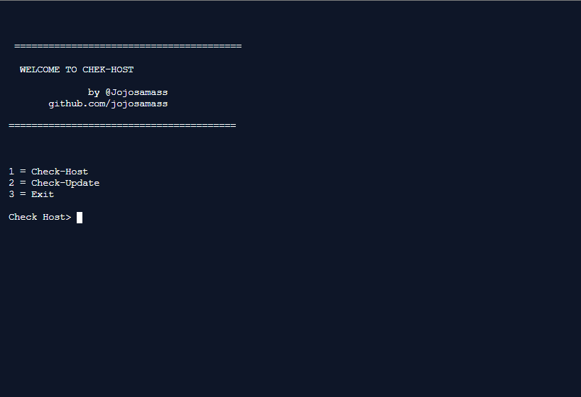

<h1>Check Host</h1>


## Installing


### Clone This Repository

```sh
$ git clone https://github.com/jojosamass/Check-Host.git
$ cd Check-Host
$ python Check-Host.py
```

## Usage
  ```sh
  python Check-Host.py
  ```
### test host check in repl
https://repl.it/@jojosamass/Check-host




